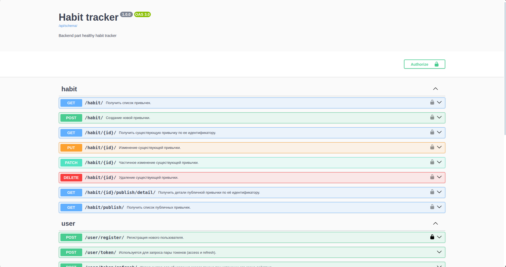
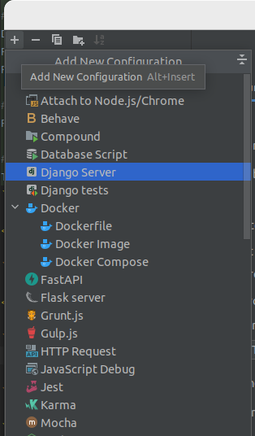

# **Healthy Habit Tracker** 
Это проект, написанный на языках 

- Python

С использованием библиотек/фреймворков:
- Django Rest Framework
- Django
- DRF spectacular
- Celery
- Redis

Служит как, backend часть управления трекером атомарных привычек (В 2018 году Джеймс Клир написал книгу «Атомные привычки», 
которая посвящена приобретению новых полезных привычек и искоренению старых плохих привычек.).</p>


### **Установка**
Для установки проекта Healthy Habit Tracker, следуйте инструкциям ниже:

<p>1. Сделайте Fork этого репозитория. Репозиторий появится в ваших личных репозиториях на GitHub.</p>

1.1 Сделайте `git clone` форкнутого репозитория, чтобы получить репозиторий локально:

<p>2. Перейдите в папку с проектом.</p>

<p>3. Создайте и активируйте виртуальное окружение:</p>

`poetry init`

`poetry shell`

<p>4. Установите зависимости проекта:</p>

`poetry install`

<p>5. Создайте файл .env в корневой папке проекта и заполните данные для настройки проекта из файла .env.sample:</p>

```ini
/.env/

# django secret_key
D_SK=YOUR_DJANGO_SECRET_KEY

# postgresql connection
POSTGRES_DB=DATABASE_NAME
POSTGRES_USER=PSQL_USERNAME
POSTGRES_PASSWORD=PSQL_PASSWORD
DB_HOST=DATABASE_HOST
DB_PORT=DATABASE_PORT

# redis url
REDIS_URL=YOUR_REDIS_URL

# telegram integration
TG_BOT_API=TELEGRAM_BOT_API_KEY
```
или для использования с Docker
```ini
/.env.docker/

# django secret_key
D_SK=YOUR_DJANGO_SECRET_KEY

# postgresql connection
POSTGRES_DB=DATABASE_NAME
POSTGRES_USER=PSQL_USERNAME
POSTGRES_PASSWORD=PSQL_PASSWORD
DB_HOST=CONTAINER_NAME
DB_PORT=DATABASE_PORT

# redis url
REDIS_URL=YOUR_REDIS_URL (for docker)

# telegram integration
TG_BOT_API=TELEGRAM_BOT_API_KEY
```
<p>6. Примените миграции:</p>

`python manage.py migrate`

<p>7. Запустите сервер, а также активируйте периодические задачи:</p>

`python manage.py runserver` или настройте запуск Django сервера в настройках.


`python manage.py su` создать пользователя для тестирования.

Выполните эти команды для старта работы периодических задач:
```ini
celery -A config worker —loglevel=info  #сначала выполните эту команду
celery -A config beat —loglevel=info  #откройте дополнительное окно терминала и выполните эту команду
```

<p>8. Зарегистрируйте своего бота telegram в главном боте BotFather:

1. Начните с ним диалог и выберите команду создания нового бота: /newbot
2. BotFather предложит ввести имя вашего бота.
3. После этого BotFather спросит юзернейм вашего бота.
4. Если имя подходит под все правила, BotFather предоставит токен и полезные ссылки для использования бота:
</p>

### **Использование**
После установки проекта Healthy Habit Tracker и запуска сервера. Вы сможете перейти на сайт 
http://127.0.0.1:8000/api/docs/ 
(если сервер запущен локально), и начать пользоваться всеми API методами проекта. Также вы можете схему данных .yaml 
файлом по адресу http://127.0.0.1:8000/api/schema/ (если сервер запущен локально).

Также стоить отметить, для того чтобы пользователям приходили уведомления в телеграм, нужно чтобы они указали свой
телеграм при регистрации и хоть раз по взаимодействовали с вашим ботом (то есть начали с ним диалог или ввели
какую то команду)


Автор
VictorVolkov7 - vektorn1212@gmail.com